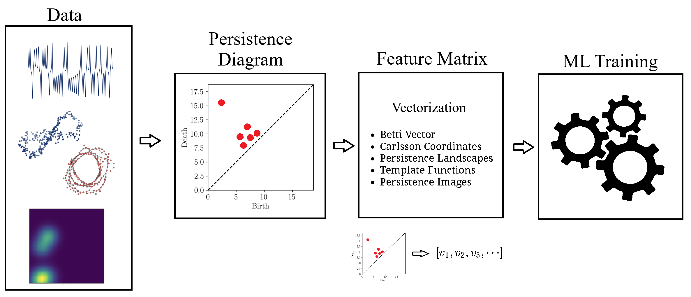

background-image: url("people/people.png")
background-size: 1200px
background-position: 100% 65%
<!-- ------------------------------------------------------- -->
<!-- DO NOT REMOVE -->

```{r setup, include=FALSE}
library(knitr)
options(htmltools.dir.version = FALSE)
knitr::opts_chunk$set(echo = FALSE)
knitr::opts_chunk$set(fig.align = 'center')
```

```{r xaringan-panelset, echo=FALSE}
xaringanExtra::use_panelset()
```

```{r xaringan-tile-view, echo=FALSE}
xaringanExtra::use_tile_view()
```

```{r xaringan-tachyons, echo=FALSE}
xaringanExtra::use_tachyons()
```

```{r xaringanExtra-freezeframe, echo=FALSE}
xaringanExtra::use_freezeframe(
  selector = ".freeze-gif",
  trigger = "click",
  overlay = TRUE,
  responsive = TRUE
)
```

```{r xaringan-editable, echo=FALSE}
xaringanExtra::use_editable(expires = 1)
```

```{r xaringan-scribble, echo=FALSE}
xaringanExtra::use_scribble()
```

<!-- ------------------------------------------------------- -->
<!-- Adjust collaborator image size and position (DO NOT INSERT ANY CODE ABOVE THIS)-->

# Acknowledgements for This Work

???
Before starting, I would like to thank all of my collaborators, Dr Khasawneh, Dr Munch, Dr Mamis, Dr Subrahmaniyam, and Josh Templeman. I would also like to thank Airforce Office of Scientific Research for funding this work.

---
# Motivation

???
Dynamical systems are widespread in nature. The motivation for my thesis stems from the growing need to develop robust methodologies for understanding and interpreting dynamic phenomena in various domains, such as aeroelasticity, chemical synthesis, neuroscience, financial markets, travel and transport, and population dynamics.

My objective for this thesis is to leverage stochsatic systems theory and topologicla data analysis for understanding dynamical systems.

--


--


--


--


--


--


--

<br><br><br><br><br><br><br><br><br><br><br><br><br>

.bg-washed-green.b--dark-green.ba.bw2.br3.shadow-1.ph1.mt1[
Objective: Leverage stochastic systems theory and topological data analysis for studying dynamical systems
]

---

???

A signal from a dynamical system which exhibits no clear pattern may be stochastic or deterministically chaotic, possibly with observation noise. It is important to be able to determine this so that the right tools are used for analysing the system. So, Chapter 1 of my thesis discusses a novel technique for identifying whether a time series is from a deterministic or a stochastic system. 

Then, in Chapter 2, I talk about a topology driven detection method for a bifurcation in stochastic systems referred to as phenomenological (P) bifurcation. 

In Chapters 3 to 5, I explore some applications of P-bifurcations in real-world systems such as modelling of aerofoil dynamic stall flutter, epidemic modelling with compartmental models, and epileptic seizure detection. 

Then, Chapter 6 is an attempt at proposing a refined and less computationally expensive algorithm for distinguising basins of attraction from attractors in deterministic systems using a markov chain based algorithm. 

Finally, Chapter 7 discusses a noise robust topology-based algorithm for detecting all zero-crossings in a discrete time signal.

Overall, this thesis is aimed at contributing to advancing the applications of topology in signal processing and dynamical systems. 

--


--


--


---
# Homology

???
Before we dive into each of these chapter, let's recap some basic concepts in computational topology.

The shape of data is measured with something called homology. This mathematical construction returns a vector space representing some aspect of the shape. 

Different dimensions of homology measure different shapes – 0-dimensional homology measures the number of clusters; 1-dimensional homology measures holes or loops; 2-dimensional homology measures voids; and there are higher dimensional analogues as well. 

On the right are displayed the homology groups for these spaces, however all that really matters for us is the dimension of the vector space, which can be seen now 

As you can see, all the spaces have one connected component, so they all have 0-dimensional homology rank 1. The number of loops are measured by 1-dimensional homology. E.g, the circle here has one loop, so it has rank 1 for 1-dimensional homology. The torus has two loops, one going around the top, and one through the center, leading to a rank of 2 for 1-dim homology.

--

.pull-left[
### What is Homology?
A topological invariant which assigns a vector space, $H_k(X)$, to a given topological space $X$.

### Dimension:

$k$ is the dimension

- 0: Clusters
- 1: Holes
- 2: Voids
]


--


---
# Persistent Homology

???
Now we look at the modern variant of homology, known as persistent homology. This is a way to study the changing shape of a changing topological space, this filtration here, by encoding its changing homology. 

We keep track of when structures appear and disappear in homology, giving us information about the structure of the space itself. 

When a new structure appears, we say that it has taken birth, and when it disappears, we say that it has died. These birth and death pairs are recorded on a persistence diagram which we'll look at on the next slides.

Next, I'll be recapping three forms of persistent homology which we'll need for this presentation. 

--

A way to watch how the homology of a filtration (sequence) of topological spaces changes so that we can understand something about the space.

--

.center[Given topological space $K$ and filtration

$K_0 \subseteq K_1 \subseteq K_2  \subseteq \cdots \subseteq K_n$

gives a sequence of maps on  homology

$H_1(K_0) \xrightarrow{} H_1(K_1) \xrightarrow{} H_1(K_2) \xrightarrow{} \cdots \xrightarrow{} H_1(K_n)$
]

--
.center[
Appearance $\xrightarrow{}$ Birth (b)

Disappearance $\xrightarrow{}$ Death (d)

Encoded on **Persistence Diagrams** as (b, d)
]

---
# Persistence Diagram from Filtration

???

--


--


--


--


--


--


--


--


---
# Signal Persistence

???
This is the last persistence type we'll be using. Technically, it's the same as the image persistence except that it's being computed for 1D signals instead of 2D images. In this case, it's easier to see the persistence as a pair of minimas and maximas of the 1D signal. 

E.g. in the animation, we see three persistence points taking birth when the level reaches the minimas, and dying one by one when the level reaches their corresponding maximas. 

--


.footnote[Animation Credits: Dr Audun Myers, Pacific Northwest National Laboratory.]

---

???
In Chapter 1, I will discuss two recently defined properties on stochastic signals which I hypothesize can be used to differentiate deterministic signal from stochastic signals. The first one connects the number of points with a fixed persistence as a function of quadratic variation, and the second one connects the persistence points in a specific box to the number of zero-crossings of the signal. 

--


---
# State of the Art

???

- Dynamical Systems Metrics: Lyapunov exponents, Correlation dimension, Entropy (KS entropy, sample entropy)  

Limitations: Require long+clean series, sensitive to noise

- Surrogate Data Testing: Hypothesis, Compare statistics against randomized surrogates  

Limitations: Requires hypothesis formulation, Results often inconclusive, Not for direct classification  

- Spectral / Statistical Methods: Power spectral density (PSD), Autocorrelation, higher-order moments  

Limitations: Chaos can mimic stochastic spectra

- Recurrence / Phase Space Methods: Recurrence plots, Delay embeddings + geometric analysis  

Limitations: Sensitive to parameters, Degrade under noise and short signals, expensive in high dimensions

--


---
# Function to Tree

???

These theorems I mentioned have been derived from trees constructed from signals. Let's look at how such a tree is generated. 
Given a continous function, a tree can be constructed from it by setting a root node against the global minima and maxima (shown as the red point at the bottom), from there moving upwards towards the maxima, and then adding a branch every time you hit a local minima. Each of these branches is given the length of the global maxima on the side of the branch, as shown in this animation. 

--

.footnote[Perez, D.: On C0-persistent homology and trees (2020). arXiv:2012.02634]

<!--- $f: \mathbb{R} \xrightarrow{} \mathbb{R}$ --->
<!--- $d_f(x,y) = f(x) + f(y) - 2\min {f(\Omega (s))}$ --->
<!--- $\Omega \text{ is a path from } x \text{ to } y$ --->
<!--- $T_f = \mathbb{R} / \{x \sim y \iff d_f(x, y) = 0\}$ --->


--


--


---
# Tree to Persistence Barcode and Diagram

???

Based on this construction, you can probably intuitively tell that it has to be connected with the sublevel persistence on a signal I described earlier. Turns out, the connection is 1-to-1. Each leaf of the tree corresponds to a persistence barcode which can be used to get the the persistence diagram for that signal.

That is, each branch in the tree we constructed corresponds to one point in the persistence diagram of the signal. 

--
.footnote[Perez, D.: On C0-persistent homology and trees (2020). arXiv:2012.02634]

<!---  --->


--

--

--

--

--

--


---
# Persistence of Continuous Semimartingales

???

As I mentioned, these theorems have technically been defined on trees built from stochastic signals, but since the tree and persistence diagram have a one-to-one relation, the theorems can be used to connect the persistence diagram with signal properties directly.

The first theorems Perez defines in his paper dictates that for stochastic signals, the expectation of the number of points of length greater than epsilon, is a function of the quadratic variation, [X]_t. Since quadratic variation for a continous deterministic signal is 0, this theorem obviously doesn't hold true for deterministic signals, and should give us a reasonable way of differentiating between stochastic signals and determinstically chaotic signals.

The second theorem connects the number of up-down crossings of a stochastic signal to the number of points in this green box in the persistence diagram.

--

<!--- $\mathbb{E}[N^\epsilon] = \frac{[M]_t}{2\epsilon^2} + \frac{2}{3} + 2\sum_{k \geq 1}(2(-1)^k - 1)\frac{\exp{\left(-\pi^2 k^2 [M]_t / 2\epsilon^2[M]_t\right)}}{\epsilon^2}\left[1 + \frac{\epsilon^2}{\pi^2 k^2 [M]_t}\right]$ --->

.footnote[D. Perez, "On the persistent homology of almost surely c0 stochastic processes,” Journal of Applied and Computational Topology, vol. 7, pp. 879–906, July 2023.]

<!--- .absolute.top-4.right-1.pa3.bg-light-gray.br3.shadow-1[$$[X]_t = \sum_{k=1}^n (X_{t_k} - X_{t_{k-1}})^2$$] --->

--

- Number of bars of length $\geq \epsilon$

$N_\epsilon = \frac{[X]_t}{2\epsilon^2} \text{ as } \epsilon \rightarrow{} 0 \text{ where }[X]_t = \int_0^t \sigma_s^2 ds$


--

<br></br>

> How to use this for discrete signals?

<br></br>

--

- $K(\epsilon) = \frac{N_\epsilon^{\text{emp}}}{N_\epsilon^{\text{theory}}} \approx 1 \quad \text{across small scale}$

- $\log N_\epsilon \sim s \log \epsilon \text{ with } s \approx -2$


---
# All Systems Considered


--


---
# Example: Ornstein-Uhlenbeck


.footnote[R = deterministic to stochastic ratio]

---
# Example: Cox-Ingersoll-Ross


.footnote[R = deterministic to stochastic ratio]

---
# Example: Linear Congruential Generator


.footnote[SNR = signal to noise ratio]

---
# Example: Lu Oscillator


.footnote[SNR = signal to noise ratio]

---
# Example: Stochastic Duffing


.footnote[R = deterministic to stochastic ratio]

---
# Example: Audio Sounds

<div style="position: relative; height: 500px;">

  

  

  

</div>

<audio id="audio1" src="figs/thunderstorm.wav"></audio>
<audio id="audio2" src="figs/chainsaw.wav"></audio>
<audio id="audio3" src="figs/clock_alarm.wav"></audio>

<script>
function playAudioAndSwap(audioId, imgId) {
  const audio = document.getElementById(audioId);
  const img = document.getElementById(imgId);

  // swap immediately on click
  img.src = img.dataset.alt;

  // restart and play audio
  audio.currentTime = 0;
  audio.play();

  // when audio ends, keep alt image OR switch back
  audio.onended = function() {
    img.src = img.dataset.alt;
  };
}
</script>


---

???

--


---
# Detection of Epileptic Seizures from EEG Signals 

???
While looking for another real-world problem to apply for my P-bifurcation work, I came across the problem of epileptic seizure detection given EEG signals. 

In EEG of an epileptic patient, three types of regimes can be found. A normal/interictal phase, a preictal phase occurring right before a seizure and an ictal phase which depicts a seizure. 

Each of these regimes' topology differs from the other, hence there is potential for TDA to be able to classify these signals.

--

<br>

Three types of regimes:

--


<div style="position: absolute; left:15%; top:80%; background-color: #8ebf42; border-radius: 10px; padding: 1%; font-family: Helvetica">
<b>Interictal</b>
</div>

--


<div style="position: absolute; left:46%; top:80%; background-color: #8ebf42; border-radius: 10px; padding: 1%; font-family: Helvetica">
<b>Preictal</b>
</div>

--


<div style="position: absolute; left:78%; top:80%; background-color: #8ebf42; border-radius: 10px; padding: 1%; font-family: Helvetica">
<b>Ictal</b>
</div>

---
# Topological Machine Learning
???

In one fo the earlier videos, you should've been familiarized with persistence diagrams. So for this video, let's start with the idea that you have somedata and you generated your persistence diagram which is in a 2D space. Your next question is: how do I incorporate this data in your ML pipeline? The answer to it is somethign called 'vectorizatoin' where a couple of techniques are used to convert persistence diagrams into a vector of features which can then be used to train your ML classfiier. We'll go over a couple pf tjese techniques in the next few slides.

--


--




---


---
# Single-Channel Simulated EEG: Jansen-Rit Neural Model

???
I started my analysis by turning to a numerical model for EEG simulations. The Jansen-Rit neural model is a 6 DOF system of Stochastic DEs used to simulate the interaction between pyramidal neurons and inhibitory interneurons in a brain. The difference of x1 and x2 state variables is said to simulate the behaviour of an EEG signal. Here the variable B is the bifurcation parameter changing which in te (50, 70) interval changes the EEG dynamics. 

--

$\dot{\color{green}{x_0}} = \color{green}{x_3}$

$\dot{\color{green}{x_3}} = 0.06\mathcal{S}(\color{green}{x_1} - \color{green}{x_2})-0.02\color{green}{x_3}-0.01^2\color{green}{x_0}$

$\dot{\color{green}{x_1}} = \color{green}{x_4}$

$\dot{\color{green}{x_4}} = 0.06(\color{red}{p} + 108\mathcal{S}(135 \color{green}{x_0})) - 0.02\color{green}{x_4} - 0.01^2\color{green}{x_1}$

$\dot{\color{green}{x_2}} = \color{green}{x_5}$

$\dot{\color{green}{x_5}} = 0.02\color{blue}{B}(33.75\mathcal{S}(33.75 \color{green}{x_0})) - 0.04\color{green}{x_5} - 0.02^2\color{green}{x_2}$

$EEG = \color{green}{x_1} - \color{green}{x_2}$ such that $\mathcal{S}(z) = \frac{5}{1 + e^{0.56(6 - z)}}$, $\color{red}{p} \sim \mathcal{N}(\mu, \sigma)$ and $\color{blue}{B} \in [50, 70]$. 

.bg-washed-green.b--dark-green.ba.bw2.br3.shadow-1.ph1.mt1[
100% accuracy with classical ML models and topological features
]


---
# Single-Channel Clinical EEG

???
Let's look at results from the major non-TDA and TDA features on our single-channel clinical EEG dataset. The x-axis on the heat map represents the feature, the y-axis represents the machine learning classifier and the color-coded cells represent the test accuracy after removing any results with overfitting. Wherever necessary, overfitting of the model to the training set was removed using K-best feature selection. 

The major non-TDA features used in literature are permutation entropy, renyi entropy, tsallis entropy and hurst exponents. The maximum accuracy of classification I was able to achieve using these features was 76.7% which rose to about 79% when all of them were combined.

Likewise, the same analysis was conducted using TDA-based features of Persistence images, carlsson coordinates and template functions and with combining all of them. I have covered the mathematical details of each of these features in a separate video sent to the committee so I won't go into those details. 

The maximum accuracy using these was a little over 85%, which is a good accuracy for a 3-class classification problem with real data, traditional ML models, no preprocessing and no hyperparameter tuning.

--

### Non-TDA Features


<br></br><br></br><br></br>

--

### TDA Features


---
# Multi-Channel EEG: ML Pipeline

???
Next, I tried expanding this analysis to multi-channel clinical EEG data. This is a work in progress. 

With multi-channel EEG data, the problem lies in choosing how to with fuse data from all channels or reduce the dimension. 

One possible solution is with fusing features from all signals together. In this, we run into the potential of corrupting the extracted features since in an interval of EEG marked as seizure all channels may or may not be depicting a seizure dynamics. Another possible solution is to use channel reduction techniques to pick seizure channels, but that nethod has the potential to heavily reduce the information available to us. 

--

---
# Multi-Channel EEG: ML Pipeline Dimensionality Reduction


---
# Methods and Results


--

<br></br><br></br><br></br><br></br><br></br>

<style>
table {
  font-size: 15px;
}
</style>

| Rank | Accuracy | Band        | Dim. Red. | Feature               | Classifier          |
|------|----------|------------|-----------|-----------------------|---------------------|
| 1    | 80.00% | Low Gamma  | FA        | Carlsson              | Conv1DMLP           |
| 2    | 79.17%   | Beta       | FA        | Carlsson              | Logistic Regression |
| 3    | 77.78%   | Delta      | LLE       | Carlsson              | Logistic Regression |
| 4    | 77.78%   | Delta      | LLE       | Carlsson              | Linear SVC          |
| 5    | 77.08%   | Beta       | FA        | Carlsson              | Linear SVC          |
| 6    | 73.67%   | Alpha      | NMF       | Polynomial Template   | MLP (sklearn)       |
| 7    | 73.33%   | Low Gamma  | FA        | Tent Template         | MLP (sklearn)       |

---
# Accuracy Comparison


--


--


--


---
# Runtime Comparison


---
# Multi-Channel EEG: ML Pipeline Feature Fusion


--

<br><br><br><br><br><br><br><br><br><br><br><br><br>

.bg-washed-green.b--dark-green.ba.bw2.br3.shadow-1.ph1.mt1[
59.5% balanced accuracy using a regularized deep multilayer perceptron classifier
]

---
# Multi-Channel EEG: Co-Fluctuation Simplicial Complex


<br></br><br></br><br></br><br></br>

- Normalization: $z_i(t) = \frac{x_i(t) - \mu_t[x_i]}{\sigma_t[x_i]}$

- Co-Fluctuation: $\xi_{0\dots k}(t) = \frac{\prod_{p=0}^{k} z_p(t) - \mu_t\left[\prod_{p=0}^{k} z_p\right]}{\sigma_t\left[\prod_{p=0}^{k}z_p\right]}$

- Weights: $w_{0\dots k}(t) = \text{sign}(\xi_{0\dots k}(t)) \cdot |\xi_{0\dots k}(t)|$

.footnote[Andrea Santoro, et al. Higher-order organization of multivariate time series. Nature Physics, January 2023.]

---
# Metrics from Persistence of Simp. Complexes


.pull-right[
- Betti Numbers
- Total Persistence
- Persistence Entropy
- Hyper-Coherence
- Hyper-Complexity
- Full Coherence
- Coherence Transition
- Full Decoherence
- Average Edge Violation
]

.footnote[Andrea Santoro, Federico Battiston, Giovanni Petri, and Enrico Amico. Higher-order organization of
multivariate time series. Nature Physics, January 2023.]

---
# Classification Metrics


--

<br></br><br></br><br></br>

| Metric                    | Mean AUC (± std) | Mean Accuracy (± std) |
|--------------------------|------------------|----------------------|
| **Coherence Transition** | **0.914 ± 0.098** | **0.771 ± 0.083** |
| Total Persistence        | 0.770 ± 0.148     | 0.636 ± 0.097     |
| Hyper Complexity         | 0.765 ± 0.147     | 0.634 ± 0.096     |
| Full Decoherence         | 0.737 ± 0.141     | 0.619 ± 0.092     |
| Hyper Coherence          | 0.592 ± 0.147     | 0.553 ± 0.098     |
| Full Coherence           | 0.586 ± 0.139     | 0.551 ± 0.089     |
| Betti # L1 norm          | 0.501 ± 0.003     | 0.662 ± 0.176     |
| Betti # L2 norm          | 0.501 ± 0.003     | 0.662 ± 0.176     |
| Avg Edge Violation       | 0.452 ± 0.121     | 0.466 ± 0.080     |
| Persistence Entropy      | 0.380 ± 0.129     | 0.436 ± 0.086     |

---

???

Finally, in Chapter 6, I present a novel approach for detecting basins of attraction in dynamical systems by utilizing hitting probabilities derived from Markov chain modeling of the system’s state space.

--


---
# Basins of Attraction

???

The analysis of basins of attraction is fundamental in understanding the long-term behavior of
nonlinear dynamical systems. These basins represent regions in the state space where trajectories
converge to stable equilibria or periodic orbits and have applications in many fields.

It's not very possible to do this analysis theoretically, and only numerical methods are possible. One commonly used approach is of discretizing the phase space and computing trajectories from each grid point, however such a method is very computational intensive and very sensitive to the discretization level.

--

.footnote[George Datseris, Alexandre Wagemakers; Effortless estimation of basins of attraction. Chaos 1 February 2022; 32 (2): 023104. https://doi.org/10.1063/5.0076568]


--


---
# State of the Art


.pull-right[
- **Absorption probability** is the likelihood that the chain will be absorbed into a state, starting from a particular state.
- **Hitting probability** is the likelihood that a particular state is reached given an initial state.
]

---
# State Space to Markov Chain

???
To address these challenges, I employ a Markov chain-based model of the discretized state space, following the set-oriented numerical methodology described by Neumann et al, which turns this deterministic problem to a stochastic one, allowing me to use measures used for markov chains.

For this conversion, the state space is partitioned into boxes each represented by a state in the markov chain. Then, one-step trajectories are generated from randomly selected initial conditions in each box. The proportions of these trajectories going from one node to another represents the transition probabilities. These two things completely defining our markvo chain representing the underlying deterministic system.

While prior studies have focused on absorption probabilities to identify attractor basins, these can be sensitive to noise and parameter changes.
Therefore, I instead compute hitting probabilities, offering greater robustness and stability, thus
allowing for more reliable analysis.

--

.footnote[N. Neumann, S. Goldschmidt, and J. Wallaschek, “On the application of set-oriented numerical methods in the analysis of railway vehicle dynamics,” PAMM, vol. 4, p. 578–579, Dec. 2004.]


---
# Types of Graphs

???

The hitting probability matrix for this markov chain can be seen on the left. In TDA, it is easy to compute rips or point cloud persistence given a distance matrix, so my first instint was to use a distance metric defined using hitting probabilities by Boyd et al instead of using this hitting probability matrix directly. However, by defnition of distance and as you can see in this plot, the distance matrix is symmetric. But the problem of finding basins of attraction is inherently asymmetric so this distance metric loses a lot of useful information and won't be able to separate basins from attractors. Hence, I want to shift my focus to TDA methods defined on directed asymmetric graphps.

--

.footnote[Z. M. Boyd, N. Fraiman, J. Marzuola, P. J. Mucha, B. Osting, and J. Weare, “A metric on directed graphs and markov chains based on hitting probabilities,” SIAM Journal on Mathematics of Data Science, vol. 3, p. 467–493, Jan. 2021.]


---
# Types of Asymmetric Graph Homology

???

There are two primary persistences defined on directed weighted graphs: dowker persistence and Flag persistence. Recently, a method of computing persistence on path homology of graphs has been introduced, referred to as persistent path homology.

This figure shows each of their persistence diagrams against two commmon directed graphs. I won't go into the detials of how each is computed, but as you can see, the method of persistent path homology has a richer persistence diagram compared to the other two methods. PPH is also known to be more sensitive to perturbation and is computationally cheaper than the other two methods. 

In the future, I plan to investigate all three of these persistences with my focus on PPH, to see if the persistence diagrams of the markov chains are capable of separating basins of attraction from their corresponding attractors.

--


---
# Asymmetric Graph Homology: Flag


.footnote[D. Luetgehetmann, D. Govc, J. Smith, and R. Levi, “Computing persistent homology of directed flag complexes,” arXiv, 2019.]

---
# Asymmetric Graph Homology: Dowker


.footnote[S. Chowdhury and F. Mémoli, “A functorial dowker theorem and persistent homology of asymmetric networks,” arXiv, 2018]

---
# Asymmetric Graph Homology: PPH and MH


.footnote[(1) Samir Chowdhury and Facundo Mémoli. 2018. Persistent path homology of directed networks. In Proceedings of the Twenty-Ninth Annual ACM-SIAM Symposium on Discrete Algorithms (SODA '18). Society for Industrial and Applied Mathematics, USA, 1152–1169. (2) T. Leinster and M. Shulman, “Magnitude homology of enriched categories and metric
spaces,” Algebraic amp; Geometric Topology, vol. 21, p. 2175–2221, Oct. 2021.
]

---
# All Systems Considered


---
# Transition Matrix: Fixed Point vs Vanderpol


---
# Hitting Probability Matrix: Fixed Point vs Vanderpol


---
# Hitting Probability Distance: Fixed Point vs Vanderpol


---
# Comparison

<br></br>

<style>
.table-container {
  display: flex;
  justify-content: space-between;
  gap: 20px;
}
.table-box {
  width: 32%;
  font-size: 12px;
}
table {
  border-collapse: collapse;
  width: 100%;
}
th, td {
  border: 1px solid #ccc;
  padding: 4px;
  text-align: center;
}
th {
  background: #f5f5f5;
}
.highlight {
  background-color: #d4edda;
}
</style>

<div class="table-container">

<div class="table-box">
<b>Markov Transition Matrix (TM)</b>
<table>
<tr><th>System</th><th colspan="2">PPH</th><th colspan="2">Dowker</th><th colspan="2">Flag</th></tr>
<tr><td></td><td>H₀</td><td>H₁</td><td>H₀</td><td>H₁</td><td>H₀</td><td>H₁</td></tr>

<tr><td>Fixed Point</td><td>✓</td><td class="highlight">×</td><td>✓</td><td>✓</td><td>✓</td><td>✓</td></tr>
<tr><td>Stable Spiral</td><td>✓</td><td class="highlight">×</td><td>✓</td><td>✓</td><td>0</td><td>0</td></tr>
<tr><td>Limit Cycle</td><td>✓</td><td class="highlight">✓</td><td>✓</td><td>✓</td><td>0</td><td>0</td></tr>
<tr><td>VdP</td><td>✓</td><td class="highlight">✓</td><td>✓</td><td>✓</td><td>0</td><td>0</td></tr>
<tr><td>Duffing</td><td>✓</td><td class="highlight">✓</td><td>✓</td><td>✓</td><td>0</td><td>0</td></tr>
</table>
</div>

<div class="table-box">
<b>Hitting Probability Distance (HPD)</b>
<table>
<tr><th>System</th><th colspan="2">PPH</th><th colspan="2">Dowker</th><th colspan="2">Flag</th></tr>
<tr><td></td><td>H₀</td><td>H₁</td><td>H₀</td><td>H₁</td><td>H₀</td><td>H₁</td></tr>

<tr><td>Fixed Point</td><td class="highlight">0</td><td>×</td><td class="highlight">0</td><td>×</td><td>✓</td><td>×</td></tr>
<tr><td>Stable Spiral</td><td class="highlight">0</td><td>×</td><td class="highlight">0</td><td>×</td><td>✓</td><td>×</td></tr>
<tr><td>Limit Cycle</td><td class="highlight">0</td><td>×</td><td class="highlight">0</td><td>×</td><td>✓</td><td>×</td></tr>
<tr><td>VdP</td><td class="highlight">✓</td><td>×</td><td class="highlight">✓</td><td>×</td><td>✓</td><td>×</td></tr>
<tr><td>Duffing</td><td class="highlight">✓</td><td>×</td><td class="highlight">✓</td><td>×</td><td>✓</td><td>×</td></tr>
</table>
</div>

<div class="table-box">
<b>Hitting Probability Matrix (HPM)</b>
<table>
<tr><th>System</th><th colspan="2">PPH</th><th colspan="2">Dowker</th><th colspan="2">Flag</th></tr>
<tr><td></td><td>H₀</td><td>H₁</td><td>H₀</td><td>H₁</td><td>H₀</td><td>H₁</td></tr>

<tr><td>Fixed Point</td><td>✓</td><td>✓</td><td>✓</td><td>×</td><td>✓</td><td class="highlight">×</td></tr>
<tr><td>Stable Spiral</td><td>✓</td><td>✓</td><td>✓</td><td>×</td><td>✓</td><td class="highlight">×</td></tr>
<tr><td>Limit Cycle</td><td>✓</td><td>✓</td><td>✓</td><td>×</td><td>✓</td><td class="highlight">✓</td></tr>
<tr><td>VdP</td><td>✓</td><td>✓</td><td>✓</td><td>×</td><td>✓</td><td class="highlight">✓</td></tr>
<tr><td>Duffing</td><td>✓</td><td>✓</td><td>✓</td><td>×</td><td>✓</td><td class="highlight">✓</td></tr>
</table>
</div>

</div>

.footnote[(1) MH not shown due to trivial results throughout. (2) Cross means no significant points, tick means significant persistence points, 0 means trivial homology.]

---
# Future: Generators to Separate Attractor from Basin


---


---
# Acknowledgements


---

```{css}
.small-text {
  font-size: 15px;
}
```


???

Thank you! The software products of my research are included in this python package called teaspoon which my researhc group delevelops. This slide also lists all the papers my current reseach has concluded into, and the papers we have planned for future granted we get positive results from my proposed directions.

This concludes my presentation. Any questions?

--


---
# The End: Where Next?

???

--

- Research-Track Faculty position at MCAIM-UMich
- Establish a new Algorithm Core


